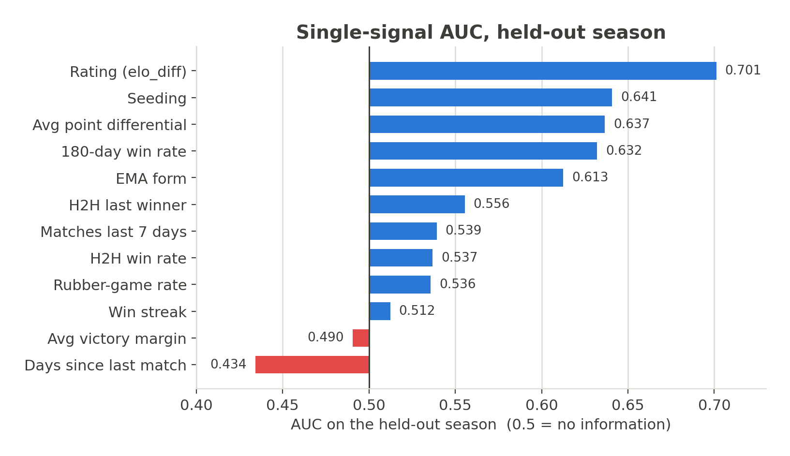
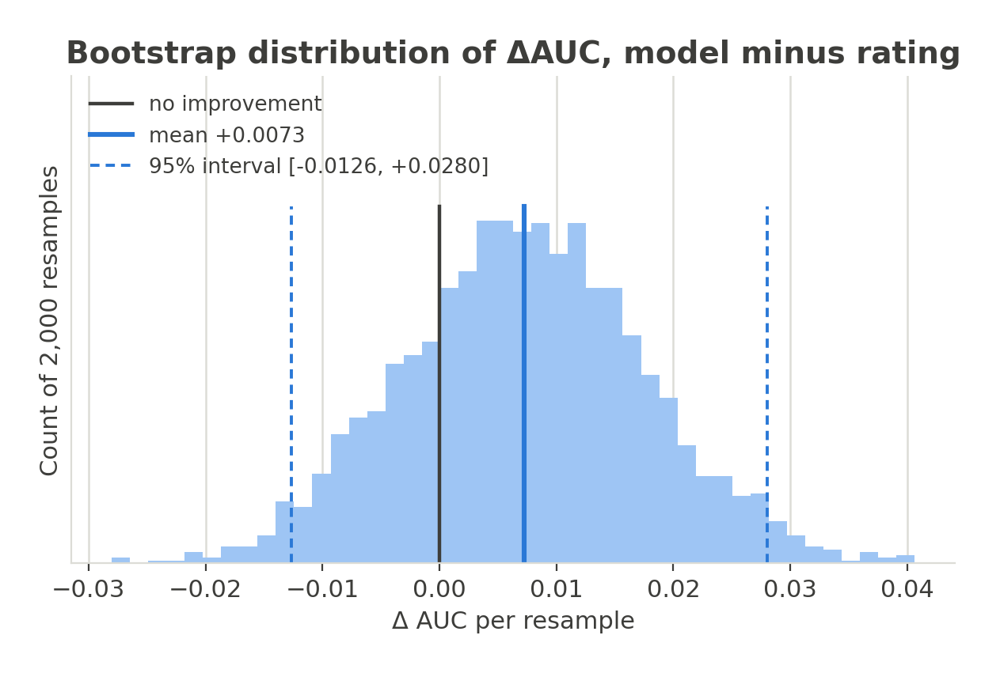
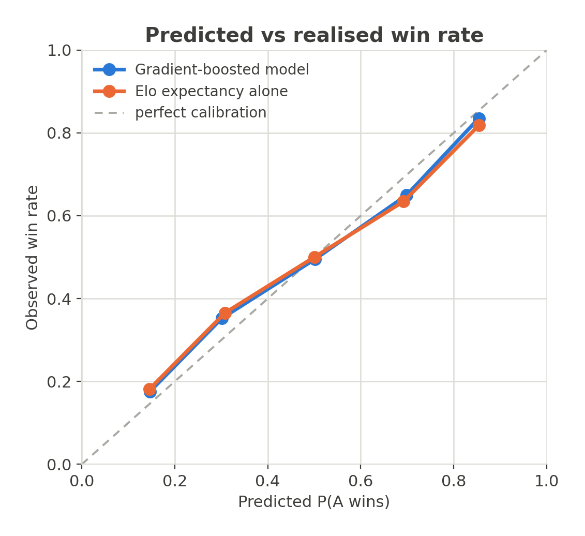

# Deuce

We scrape seventeen seasons of BWF men's singles results from Wikipedia, construct a pre-match
representation of each match, and evaluate whether that representation predicts the winner. Most
of the predictive power comes from an Elo variant whose constants are fitted rather than assumed.
Gradient-boosted trees are fit on top of it, and a Monte Carlo simulation propagates per-match
probabilities into a distribution over tournament outcomes. A static site applies these models
to live draws.

The headline result is a modest one. On a held-out season of 543 matches the fitted rating alone
reaches 0.7012 AUC and the best tuned model reaches 0.7085, an improvement of +0.0073 whose 95%
bootstrap interval, [−0.0126, +0.0280], comfortably contains zero. We therefore report that the
rating accounts for nearly all of the attainable performance, and that the remaining 34 features
and the hyperparameter search contribute an increment we cannot separate from sampling noise.

## Prediction target and data

We predict one match at a time, estimating P(player A wins) conditional on the information
available before the match begins. Singles matches cannot be drawn, so this single quantity
specifies the outcome distribution completely.

The corpus is 327 tournaments and 10,204 matches recorded since 2010, of which 9,920 are
completed and usable. Unplayed draws, walkovers and retirements retain their bracket slot but
never enter training, history or a rating update. We partition by date rather than at random:
18,754 rows before 2026 for training, and 2026 to date for testing, comprising 1,086 rows over
543 matches. A random partition would leak the label directly, because every row of a tournament
shares one date and a semi-final could be assigned to training while its own quarter-final was
assigned to test. Hyperparameters are tuned on the penultimate season so that the test season
remains unused, and the vocabularies and the scaler are fit on the training partition alone.

The assignment of players to slot A and slot B is an artifact of how a bracket is recorded and
carries no information. We eliminate it in two ways. Each match appears **twice** in the training
set, once as recorded and once with the players exchanged and the label inverted, which is what
yields 19,840 rows from 9,920 matches. Each prediction is then evaluated in both orientations
and averaged:

```
P(A beats B) = [ P(A wins | A in slot A) + (1 − P(B wins | B in slot A)) ] / 2
```

so that P(A beats B) and 1 − P(B beats A) agree exactly rather than approximately.

Exchanging the players is not equivalent to negating the row. Features defined for an individual
player retain their values and travel with that player; only pair-level features are inverted,
namely the label, `elo_diff`, `elo_expected` and the two head-to-head signals. We assert this
invariant in the test suite, because an earlier implementation negated a per-player column in
addition to exchanging it and left slot A incorrectly signed in every mirrored row.

## Signals

The representation comprises four categorical features (`tier`, `round`, and both player
identities as a learned vocabulary) and thirty-one continuous ones. Each continuous feature is
computed only from matches dated strictly before the row it describes, so that matches played on
the same day cannot inform one another.

**Rating.** `elo_diff`, together with the rating's own win probability
`elo_expected = 1 / (1 + 10^(−elo_diff / SCALE))`. The constants were fitted on the 2019–2023
seasons and evaluated on 2024–2026, which the fitting procedure never observed. Under the fitted
constants the rating alone improves from 0.6868 to 0.7135 AUC, with no model applied on top.

| constant | fitted | role |
|---|---|---|
| `SCALE` | 569.6 | points per decade of odds; Elo's conventional 400 is too steep for these data |
| `K_BASE` | 12.3 | base step per result |
| `MOV` | 3.774 | margin of victory, so that 21–5 moves a rating further than 22–20 |
| `PROVISIONAL_K` / `_N` | 28.77 for 23 matches | a new entrant departs 1500 within a few events rather than a season |
| `DECAY` | 0.0201 / yr | drift toward the mean during a layoff, after 60 days of grace |
| `TIER_ALPHA` | 0.0589 | fitted close to zero, indicating that the hand-set 20-to-50 spread it replaced had little effect |

We supply `elo_expected` in addition to `elo_diff` deliberately. A tree can approximate a
logistic function only by a staircase of splits, so providing the transformed quantity directly
accounts for most of the benefit the improved rating confers. The remaining features are defined
per player:

- **Form:** an EMA of results (α = 0.3), win rate over the trailing 180 days, and a signed win
  streak.
- **Rest:** days since the last match, and match counts over the trailing 7 and 14 days. The
  tour schedules consecutive weeks, and a quarter-final is frequently a player's fourth match in
  four days.
- **Margins:** point differential, victory margin, games per match and rubber-game rate, each
  over the last 10 matches. Two players may hold identical records while differing substantially
  in form.
- **Head-to-head:** win rate against the specific opponent, and the winner of the most recent
  meeting. Both default to 0.5 for a pair that has never met, so the reverse direction is not
  1 − x and we query both directions.
- **Context:** seeding, home advantage and shared nationality.

## Model

Gradient-boosted trees are appropriate for these data. The design matrix is tabular, with
approximately 9,900 observations over 35 features; the informative structure consists of
thresholds and low-order interactions; feature scales span three orders of magnitude; the
logistic objective yields probabilities rather than a ranking; and TreeSHAP provides exact
attributions.

We retain XGBoost, LightGBM and CatBoost, tuned with Optuna to approximately 1,000 to 1,400
shallow trees. Whichever model wins the current holdout is promoted and refit on all completed
matches. Because that winner changes between runs, no downstream component assumes a model type.

A single global model suffices to predict the coming week, but it cannot support a claim about a
tournament held in 2019. Each past or live tournament is therefore served by a separate
point-in-time model whose vocabulary, scaler and estimator are fit only on matches completed
before that tournament began. The model that predicts the 2019 All England has not observed that
tournament, nor any match subsequent to it.

## Results

The figures below are regenerated from the corpus by `analysis/make_figures.py`, so the reported
numbers track the data rather than becoming stale.

### Signals in isolation

We first score each signal on its own as a ranker of the held-out rows. For a feature defined
per player, the signal is the difference between the two players' values.



The rating dominates, and no other signal falls within 0.06 AUC of it. Seeding, point
differential, win rate and EMA form largely re-express the same recent results, which explains
why their contribution within the fitted model is smaller than their univariate scores suggest.

Two features warrant comment as diagnostics rather than as signals. Average victory margin
(0.490) is indistinguishable from chance. Days since last match (0.434) orders matches in the
wrong direction, in that the player who competed more recently wins more frequently. We
attribute this to survivorship rather than to fitness, since a player who competed on the
previous day is typically still active in a draw.

### Held-out season

Each candidate was fit on the pre-2026 rows and evaluated once on the test season, alongside the
fitted rating with no model applied on top.

| | AUC | logloss | Brier |
|---|---|---|---|
| Elo expectancy alone | 0.7012 | 0.6300 | 0.2207 |
| XGBoost | 0.7043 | 0.6314 | 0.2204 |
| **LightGBM** | **0.7085** | **0.6247** | **0.2180** |
| CatBoost | 0.6937 | 0.6448 | 0.2258 |

The trees outperform the rating, but the improvement is not distinguishable from zero.
Bootstrapping over matches rather than rows, since the two mirrored rows of a match constitute a
single observation, gives ΔAUC **+0.0073 with a 95% interval of [−0.0126, +0.0280]**.



We likewise do not interpret the ordering of the three candidates. Their range is 0.015 AUC
against a standard error of approximately 0.02, and CatBoost led this comparison four days
earlier at 0.7300 before ranking last in it. Refitting under different random seeds does not
address this, because the models are deterministic given fixed data; a three-seed run reports
three identical values and conveys an unwarranted impression of precision. Comparisons we treat
as informative use the paired bootstrap over several temporal folds.

### Calibration

The predictions must function as probabilities and not merely as a ranking, because the
simulation compounds them across five rounds. A systematically overconfident model therefore
misstates a title probability by more than it misstates any individual match.



Both are well calibrated near the centre of the range and overconfident toward the extremes:
matches assigned 0.6 to 0.8 are won approximately 65% of the time. Brier score and log loss
improve slightly relative to the rating, which is where the small advantage of the trees is
realised. We apply no post-hoc calibration correction.

## Tournament simulation

Winning a 32-player draw requires winning five matches against opponents who are themselves
uncertain, so a title probability is a distribution over paths rather than a single prediction.
We simulate each tournament 10,000 times, proceeding round by round: predict, sample a uniform
variate, advance a winner, and pair the winners.

- **Form propagates within the bracket.** Elo, EMA and win streak are updated per simulation.
  The in-bracket update omits the margin-of-victory term, since a simulated match has a winner
  but no scoreline; the score-derived features are held fixed, as generating a scoreline would
  amount to fabricating data.
- **Live draws are conditioned on observed results.** Completed matches are fixed to their
  actual outcome in all 10,000 simulations. A completed draw conditioned on its own results
  returns the actual champion with probability 1, which the test suite asserts.
- **Realised pairings use their engineered row.** For a hypothetical match between two
  undetermined winners, the engine can only reconstruct state by replaying the draw from the
  first round. Once a pairing is realised, however, the pipeline has engineered a row for it
  that reflects the rounds already played, and we use that row's estimate in preference to the
  reconstruction.

Every match of a round, across all simulations and both orientations, is submitted in a single
`predict_proba` call, so one bracket requires approximately three seconds.

## Attribution

Each match card reports a SHAP decomposition: the contribution of every input to that particular
prediction, summing exactly to the difference between the prediction and the base rate. TreeSHAP
is exact for tree ensembles, so the decomposition reproduces the model's arithmetic rather than
approximating it. We aggregate the 35 features into 9 drivers (Rating, Recent form,
Head-to-head, Seeding, Rest & workload, Scoring margin, Home & nation, Player identity, Match
context); additivity makes the within-group sums exact, so a reader sees "Rating +0.18" in place
of thirty-five signed coefficients.

## License

GPL-3.0-or-later, Copyright (C) 2026 melthu. See [LICENSE](LICENSE).

Match data is scraped from Wikipedia and is [CC BY-SA 4.0](https://creativecommons.org/licenses/by-sa/4.0/)
upstream; the GPL covers this repository's code, not that data.
